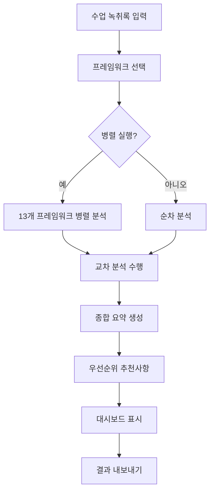

# AIBOA 종합 분석 프레임워크 구현 가이드
## Comprehensive Analysis Framework Implementation Guide

### 📋 개요

이 가이드는 AIBOA 플랫폼에 13개의 교육 분석 프레임워크를 통합하는 방법을 상세히 설명합니다. 기존 CBIL 프레임워크에 12개의 새로운 분석 프레임워크를 추가하여 교육 효과성을 다각도로 분석할 수 있도록 구현합니다.

### 🎯 목표

- **일관성**: Temperature 0.3으로 안정적인 분석 결과 보장
- **확장성**: 새로운 프레임워크 쉽게 추가 가능한 구조
- **성능**: 13개 프레임워크 병렬 실행으로 빠른 분석
- **사용성**: 토글 기반 UI로 프레임워크 간 비교 용이

---

## 🏗️ 시스템 아키텍처

### 1. 프론트엔드 구조

```
frontend/src/
├── types/
│   ├── analysis.ts                    # 기존 분석 타입
│   └── comprehensive-analysis.ts      # 새로운 13개 프레임워크 타입
├── lib/
│   ├── analysis-api.ts               # 기존 API 클라이언트
│   └── comprehensive-analysis-service.ts  # 종합 분석 서비스
├── components/
│   ├── analysis/
│   │   ├── analysis-result.tsx       # 기존 단일 결과 표시
│   │   ├── framework-selector.tsx    # 기존 프레임워크 선택기
│   │   └── comprehensive-analysis-dashboard.tsx  # 새로운 종합 대시보드
│   └── charts/                       # 프레임워크별 차트 컴포넌트
└── app/
    └── analysis/
        └── comprehensive/
            └── page.tsx              # 종합 분석 페이지
```

### 2. 백엔드 구조

```
services/analysis/
├── app/
│   ├── services/
│   │   ├── cbil_analyzer.py          # 기존 CBIL 분석기
│   │   ├── solar_llm.py             # 기존 LLM 서비스
│   │   └── comprehensive_analyzer.py # 새로운 종합 분석기
│   ├── routers/
│   │   ├── analyze.py               # 기존 단일 분석 라우터
│   │   └── comprehensive.py         # 새로운 종합 분석 라우터
│   └── models.py                    # 확장된 데이터 모델
└── prompts/
    ├── cbil_prompts.py             # CBIL 프롬프트
    └── framework_prompts.py        # 12개 프레임워크 프롬프트
```

---

## 🔧 구현 단계

### Phase 1: 핵심 교육 요소 프레임워크 (우선순위 1)

#### 1.1 QTA (Question Type Analysis) 구현

**백엔드 구현:**

```python
# services/analysis/app/services/qta_analyzer.py

from typing import Dict, List, Any
from .solar_llm import SolarLLMService

class QTAAnalyzer:
    def __init__(self):
        self.solar_service = SolarLLMService()
        self.question_patterns = {
            "closed": ["맞나요", "인가요", "몇", "얼마"],
            "open": ["어떻게 생각", "왜", "어떤 방법"],
            "checking": ["이해했", "알겠", "따라올"],
            "leading": ["~하지 않나요", "분명히", "당연히"],
            "inquiry": ["근거", "증거", "다른 관점"],
            "creative": ["새로운", "다른 방법", "만약"],
            "metacognitive": ["어떻게 알았", "왜 그렇게 생각"]
        }
    
    async def analyze(self, text: str) -> Dict[str, Any]:
        prompt = f"""
        교육학 전문가로서 교사의 질문 패턴을 분석하세요.
        
        다음 7가지 유형으로 질문을 분류하세요:
        1. 폐쇄형 (단답형)
        2. 개방형 (다양한 답변)  
        3. 확인형 (이해도 점검)
        4. 유도형 (특정 답변 유도)
        5. 탐구형 (깊이 있는 사고)
        6. 창의형 (창의적 사고)
        7. 메타인지형 (학습 과정 성찰)
        
        분석할 텍스트: "{text}"
        
        JSON 형식으로 응답하세요:
        {{
            "questions_found": [
                {{
                    "text": "질문 텍스트",
                    "type": 1-7,
                    "reasoning": "분류 근거",
                    "cognitive_level": 1-7
                }}
            ],
            "question_distribution": {{
                "closed": 0.0-1.0,
                "open": 0.0-1.0,
                "checking": 0.0-1.0,
                "leading": 0.0-1.0,
                "inquiry": 0.0-1.0,
                "creative": 0.0-1.0,
                "metacognitive": 0.0-1.0
            }},
            "question_density": 0.0-1.0,
            "engagement_score": 0-100,
            "recommendations": ["개선 제안들"]
        }}
        """
        
        response = await self.solar_service._call_solar_api(
            system_prompt="질문 분석 전문가",
            user_prompt=prompt,
            temperature=0.3
        )
        
        return self._parse_qta_response(response)
```

#### 1.2 SEI (Student Engagement Indicators) 구현

```python
# services/analysis/app/services/sei_analyzer.py

class SEIAnalyzer:
    def __init__(self):
        self.solar_service = SolarLLMService()
        self.engagement_indicators = {
            "passive_listening": ["설명합니다", "들어보세요", "이야기해드릴게요"],
            "simple_response": ["네", "아니요", "맞아요"],
            "question_participation": ["질문있나요", "궁금한 것"],
            "discussion_participation": ["어떻게 생각해요", "의견을 말해보세요"],
            "collaborative_activity": ["함께", "그룹으로", "팀별로"],
            "leading_presentation": ["발표해보세요", "설명해주세요"]
        }
    
    async def analyze(self, text: str) -> Dict[str, Any]:
        prompt = f"""
        교실 상호작용 전문가로서 학습자 참여도를 분석하세요.
        
        6단계 참여 수준으로 분류하세요:
        1. 수동적 청취 - 일방향 강의
        2. 단순 응답 - 짧은 답변
        3. 질문 참여 - 학생의 질문
        4. 토론 참여 - 의견 교환
        5. 협력 활동 - 그룹 작업
        6. 주도적 발표 - 학생 주도
        
        분석할 텍스트: "{text}"
        
        JSON 응답:
        {{
            "engagement_levels": {{
                "passive_listening": 0.0-1.0,
                "simple_response": 0.0-1.0,
                "question_participation": 0.0-1.0,
                "discussion_participation": 0.0-1.0,
                "collaborative_activity": 0.0-1.0,
                "leading_presentation": 0.0-1.0
            }},
            "interaction_metrics": {{
                "teacher_talk_ratio": 0.0-1.0,
                "student_response_ratio": 0.0-1.0,
                "wait_time_average": 숫자,
                "interruption_count": 숫자
            }},
            "engagement_trend": "increasing/stable/decreasing",
            "participation_equity": 0-100,
            "recommendations": ["개선 방안들"]
        }}
        """
        
        response = await self.solar_service._call_solar_api(
            system_prompt="참여도 분석 전문가",
            user_prompt=prompt,
            temperature=0.3
        )
        
        return self._parse_sei_response(response)
```

#### 1.3 종합 분석 라우터 구현

```python
# services/analysis/app/routers/comprehensive.py

from fastapi import APIRouter, HTTPException, Depends
from typing import List, Dict, Any
import asyncio
from ..services.qta_analyzer import QTAAnalyzer
from ..services.sei_analyzer import SEIAnalyzer
from ..services.cbil_analyzer import CBILAnalyzer
# ... other analyzers

router = APIRouter(prefix="/api/comprehensive", tags=["comprehensive"])

class ComprehensiveAnalysisRequest(BaseModel):
    text: str
    frameworks: List[str]
    parallel_execution: bool = True
    temperature: float = 0.3
    include_cross_analysis: bool = True

@router.post("/analyze")
async def comprehensive_analyze(
    request: ComprehensiveAnalysisRequest,
    api_key: str = Depends(verify_api_key)
):
    """13개 프레임워크를 사용한 종합 분석"""
    
    analyzers = {
        "cbil": CBILAnalyzer(),
        "qta": QTAAnalyzer(),
        "sei": SEIAnalyzer(),
        # ... other analyzers
    }
    
    try:
        if request.parallel_execution:
            # 병렬 실행
            tasks = []
            for framework_id in request.frameworks:
                if framework_id in analyzers:
                    analyzer = analyzers[framework_id]
                    task = analyzer.analyze(request.text)
                    tasks.append((framework_id, task))
            
            results = {}
            for framework_id, task in tasks:
                try:
                    results[framework_id] = await task
                except Exception as e:
                    logger.error(f"Framework {framework_id} failed: {e}")
                    results[framework_id] = get_default_result(framework_id)
        else:
            # 순차 실행
            results = {}
            for framework_id in request.frameworks:
                if framework_id in analyzers:
                    analyzer = analyzers[framework_id]
                    results[framework_id] = await analyzer.analyze(request.text)
        
        # 교차 분석 수행
        cross_insights = []
        if request.include_cross_analysis:
            cross_insights = generate_cross_framework_insights(results)
        
        # 전체 요약 생성
        overall_summary = generate_overall_summary(results)
        
        # 우선순위 추천사항 생성
        recommendations = generate_prioritized_recommendations(results, cross_insights)
        
        return {
            "id": generate_analysis_id(),
            "frameworks_analyzed": request.frameworks,
            "individual_results": results,
            "cross_framework_insights": cross_insights,
            "overall_summary": overall_summary,
            "recommendations": recommendations,
            "metadata": {
                "parallel_execution": request.parallel_execution,
                "temperature_used": request.temperature,
                "text_length": len(request.text),
                "created_at": datetime.utcnow().isoformat()
            }
        }
        
    except Exception as e:
        raise HTTPException(status_code=500, detail=f"Analysis failed: {str(e)}")
```

### Phase 2: 프론트엔드 통합

#### 2.1 종합 분석 페이지 생성

```typescript
// frontend/src/app/analysis/comprehensive/page.tsx

'use client'

import { useState } from 'react'
import { ComprehensiveAnalysisDashboard } from '@/components/analysis/comprehensive-analysis-dashboard'
import { PageHeader } from '@/components/ui/page-header'
import { Card, CardContent } from '@/components/ui/card'
import { Textarea } from '@/components/ui/textarea'

export default function ComprehensiveAnalysisPage() {
  const [analysisText, setAnalysisText] = useState('')

  return (
    <div className="container mx-auto py-6 space-y-6">
      <PageHeader
        title="종합 교육 분석"
        description="13개의 분석 프레임워크로 교육의 모든 측면을 다각도로 분석합니다"
      />

      {/* Text Input */}
      <Card>
        <CardContent className="pt-6">
          <div className="space-y-2">
            <label className="text-sm font-medium">분석할 수업 내용</label>
            <Textarea
              placeholder="수업 녹취록이나 스크립트를 입력하세요..."
              value={analysisText}
              onChange={(e) => setAnalysisText(e.target.value)}
              rows={8}
              className="min-h-[200px]"
            />
          </div>
        </CardContent>
      </Card>

      {/* Comprehensive Analysis Dashboard */}
      {analysisText.length > 100 && (
        <ComprehensiveAnalysisDashboard
          text={analysisText}
          onAnalysisComplete={(result) => {
            console.log('Analysis completed:', result)
          }}
          onAnalysisError={(error) => {
            console.error('Analysis failed:', error)
          }}
        />
      )}
    </div>
  )
}
```

#### 2.2 기존 분석 페이지에 종합 분석 링크 추가

```typescript
// frontend/src/components/analysis/analysis-result.tsx 수정

export function AnalysisResult({ result }: AnalysisResultProps) {
  // ... 기존 코드

  return (
    <div className="space-y-6">
      {/* 기존 CBIL 결과 표시 */}
      {/* ... */}

      {/* 종합 분석 안내 */}
      <Card>
        <CardHeader>
          <CardTitle className="flex items-center gap-2">
            <BarChart3 className="h-5 w-5" />
            더 자세한 분석이 필요하신가요?
          </CardTitle>
          <CardDescription>
            13개의 교육 분석 프레임워크로 더 깊이 있는 분석을 받아보세요.
          </CardDescription>
        </CardHeader>
        <CardContent>
          <Link href="/analysis/comprehensive">
            <Button className="w-full">
              종합 분석 시작하기
              <ArrowRight className="h-4 w-4 ml-2" />
            </Button>
          </Link>
        </CardContent>
      </Card>
    </div>
  )
}
```

### Phase 3: 시각화 및 차트 구현

#### 3.1 프레임워크별 차트 컴포넌트

```typescript
// frontend/src/components/charts/framework-charts.tsx

import { BarChart, Bar, XAxis, YAxis, CartesianGrid, Tooltip, ResponsiveContainer } from 'recharts'
import { PieChart, Pie, Cell } from 'recharts'
import { RadarChart, Radar, PolarGrid, PolarAngleAxis, PolarRadiusAxis } from 'recharts'

export function QTAChart({ data }: { data: QTAAnalysisResult }) {
  const chartData = Object.entries(data.question_distribution).map(([type, value]) => ({
    type: type.replace('_', ' '),
    value: Math.round(value * 100),
    count: Math.round(value * 100) // 실제로는 질문 개수
  }))

  return (
    <div className="space-y-4">
      <h4 className="font-medium">질문 유형 분포</h4>
      <ResponsiveContainer width="100%" height={300}>
        <BarChart data={chartData}>
          <CartesianGrid strokeDasharray="3 3" />
          <XAxis dataKey="type" />
          <YAxis />
          <Tooltip formatter={(value) => [`${value}%`, '비율']} />
          <Bar dataKey="value" fill="#8b5cf6" />
        </BarChart>
      </ResponsiveContainer>
    </div>
  )
}

export function SEIChart({ data }: { data: SEIAnalysisResult }) {
  const chartData = Object.entries(data.engagement_levels).map(([level, value]) => ({
    level: level.replace('_', ' '),
    value: Math.round(value * 100)
  }))

  const COLORS = ['#ef4444', '#f97316', '#eab308', '#22c55e', '#3b82f6', '#8b5cf6']

  return (
    <div className="space-y-4">
      <h4 className="font-medium">학습자 참여 수준</h4>
      <ResponsiveContainer width="100%" height={300}>
        <PieChart>
          <Pie
            data={chartData}
            cx="50%"
            cy="50%"
            outerRadius={80}
            fill="#8884d8"
            dataKey="value"
            label={({ level, value }) => `${level}: ${value}%`}
          >
            {chartData.map((entry, index) => (
              <Cell key={`cell-${index}`} fill={COLORS[index % COLORS.length]} />
            ))}
          </Pie>
          <Tooltip />
        </PieChart>
      </ResponsiveContainer>
    </div>
  )
}

// 다른 프레임워크별 차트 컴포넌트들...
```

---

## 🔄 통합 워크플로우

### 1. 사용자 워크플로우



### 2. API 호출 플로우

```javascript
// frontend/src/lib/comprehensive-analysis-api.ts

export class ComprehensiveAnalysisAPI {
  private baseUrl: string
  private apiKey: string

  constructor(baseUrl: string, apiKey: string) {
    this.baseUrl = baseUrl
    this.apiKey = apiKey
  }

  async analyzeComprehensive(
    text: string,
    frameworks: string[],
    options: {
      parallelExecution?: boolean
      temperature?: number
      includeCrossAnalysis?: boolean
    } = {}
  ): Promise<ComprehensiveAnalysisResult> {
    const response = await fetch(`${this.baseUrl}/api/comprehensive/analyze`, {
      method: 'POST',
      headers: {
        'Content-Type': 'application/json',
        'X-API-Key': this.apiKey
      },
      body: JSON.stringify({
        text,
        frameworks,
        parallel_execution: options.parallelExecution ?? true,
        temperature: options.temperature ?? 0.3,
        include_cross_analysis: options.includeCrossAnalysis ?? true
      })
    })

    if (!response.ok) {
      throw new Error(`Analysis failed: ${response.statusText}`)
    }

    return await response.json()
  }

  async getFrameworkResult(
    analysisId: string,
    frameworkId: string
  ): Promise<FrameworkSpecificResult> {
    const response = await fetch(
      `${this.baseUrl}/api/comprehensive/analysis/${analysisId}/framework/${frameworkId}`,
      {
        headers: { 'X-API-Key': this.apiKey }
      }
    )

    if (!response.ok) {
      throw new Error(`Failed to get framework result: ${response.statusText}`)
    }

    return await response.json()
  }

  async exportAnalysis(
    analysisId: string,
    format: 'json' | 'pdf' | 'csv'
  ): Promise<Blob> {
    const response = await fetch(
      `${this.baseUrl}/api/comprehensive/analysis/${analysisId}/export?format=${format}`,
      {
        headers: { 'X-API-Key': this.apiKey }
      }
    )

    if (!response.ok) {
      throw new Error(`Export failed: ${response.statusText}`)
    }

    return await response.blob()
  }
}
```

---

## 🧪 테스트 전략

### 1. 단위 테스트

```python
# services/analysis/tests/test_comprehensive.py

import pytest
from app.services.qta_analyzer import QTAAnalyzer
from app.services.sei_analyzer import SEIAnalyzer

@pytest.mark.asyncio
async def test_qta_analyzer():
    analyzer = QTAAnalyzer()
    
    # 질문이 포함된 텍스트
    text = "오늘 배운 내용이 무엇인가요? 이해했나요? 어떻게 생각하세요?"
    
    result = await analyzer.analyze(text)
    
    assert "question_distribution" in result
    assert "recommendations" in result
    assert len(result["questions_found"]) > 0

@pytest.mark.asyncio
async def test_sei_analyzer():
    analyzer = SEIAnalyzer()
    
    # 다양한 참여 수준을 보여주는 텍스트
    text = "설명을 들어보세요. 질문있나요? 함께 토론해봅시다. 발표해보세요."
    
    result = await analyzer.analyze(text)
    
    assert "engagement_levels" in result
    assert "interaction_metrics" in result
    assert result["engagement_trend"] in ["increasing", "stable", "decreasing"]

@pytest.mark.asyncio
async def test_comprehensive_analysis():
    # 통합 테스트
    from app.routers.comprehensive import comprehensive_analyze
    
    request = {
        "text": "수업 내용 샘플...",
        "frameworks": ["cbil", "qta", "sei"],
        "parallel_execution": True,
        "temperature": 0.3
    }
    
    result = await comprehensive_analyze(request)
    
    assert len(result["individual_results"]) == 3
    assert "cross_framework_insights" in result
    assert "overall_summary" in result
```

### 2. 통합 테스트

```typescript
// frontend/src/__tests__/comprehensive-analysis.test.tsx

import { render, screen, fireEvent, waitFor } from '@testing-library/react'
import { ComprehensiveAnalysisDashboard } from '@/components/analysis/comprehensive-analysis-dashboard'

describe('ComprehensiveAnalysisDashboard', () => {
  const mockText = "샘플 수업 녹취록..."

  test('프레임워크 선택 기능', () => {
    render(<ComprehensiveAnalysisDashboard text={mockText} />)
    
    // 모든 프레임워크가 표시되는지 확인
    expect(screen.getByText('인지적 부담 기반 교육언어 분석')).toBeInTheDocument()
    expect(screen.getByText('질문 유형 분석')).toBeInTheDocument()
    
    // 프레임워크 선택/해제 기능
    const qtaFramework = screen.getByText('질문 유형 분석').closest('div')
    fireEvent.click(qtaFramework!)
    
    // 선택 상태 변경 확인
    expect(qtaFramework).toHaveClass('border-blue-500')
  })

  test('종합 분석 실행', async () => {
    const onComplete = jest.fn()
    render(
      <ComprehensiveAnalysisDashboard 
        text={mockText} 
        onAnalysisComplete={onComplete}
      />
    )
    
    // 분석 시작 버튼 클릭
    const startButton = screen.getByText('종합 분석 시작')
    fireEvent.click(startButton)
    
    // 진행률 표시 확인
    await waitFor(() => {
      expect(screen.getByText('분석 진행률')).toBeInTheDocument()
    })
    
    // 결과 완료 확인 (Mock API 사용)
    await waitFor(() => {
      expect(onComplete).toHaveBeenCalled()
    }, { timeout: 10000 })
  })
})
```

---

## 🚀 배포 및 운영

### 1. 환경 설정

```yaml
# docker-compose.yml 수정

version: '3.8'
services:
  analysis-service:
    build: ./services/analysis
    environment:
      - COMPREHENSIVE_FRAMEWORKS_ENABLED=true
      - MAX_PARALLEL_FRAMEWORKS=13
      - LLM_TEMPERATURE=0.3
      - REDIS_URL=redis://redis:6379
    depends_on:
      - redis
      - postgres

  redis:
    image: redis:7-alpine
    ports:
      - "6379:6379"

  postgres:
    image: postgres:15
    environment:
      - POSTGRES_DB=aiboa_comprehensive
      - POSTGRES_USER=aiboa
      - POSTGRES_PASSWORD=${DB_PASSWORD}
```

### 2. Railway 배포 설정

```toml
# railway.toml 업데이트

[build]
builder = "DOCKERFILE"
dockerfilePath = "Dockerfile"

[deploy]
numReplicas = 1
sleepApplication = false
restartPolicyType = "ON_FAILURE"

[[deploy.environmentVariables]]
name = "COMPREHENSIVE_FRAMEWORKS_ENABLED"
value = "true"

[[deploy.environmentVariables]]
name = "MAX_PARALLEL_FRAMEWORKS"
value = "13"

[[deploy.environmentVariables]]
name = "LLM_TEMPERATURE"
value = "0.3"
```

### 3. 모니터링 및 로깅

```python
# services/analysis/app/monitoring.py

import logging
import time
from functools import wraps
from typing import Dict, Any

logger = logging.getLogger(__name__)

def monitor_framework_performance(framework_id: str):
    """프레임워크별 성능 모니터링 데코레이터"""
    def decorator(func):
        @wraps(func)
        async def wrapper(*args, **kwargs):
            start_time = time.time()
            
            try:
                result = await func(*args, **kwargs)
                execution_time = time.time() - start_time
                
                logger.info(f"Framework {framework_id} completed in {execution_time:.2f}s")
                
                # 메트릭 수집 (예: Prometheus)
                framework_execution_time.labels(framework=framework_id).observe(execution_time)
                framework_success_total.labels(framework=framework_id).inc()
                
                return result
                
            except Exception as e:
                execution_time = time.time() - start_time
                
                logger.error(f"Framework {framework_id} failed in {execution_time:.2f}s: {e}")
                
                framework_error_total.labels(framework=framework_id).inc()
                raise
                
        return wrapper
    return decorator

def log_comprehensive_analysis(analysis_request: Dict[str, Any]):
    """종합 분석 요청 로깅"""
    logger.info(f"Comprehensive analysis started: {analysis_request}")
    
    # 분석 요청 통계
    frameworks_count = len(analysis_request.get("frameworks", []))
    text_length = len(analysis_request.get("text", ""))
    parallel_execution = analysis_request.get("parallel_execution", False)
    
    logger.info(f"Analysis metrics: frameworks={frameworks_count}, "
                f"text_length={text_length}, parallel={parallel_execution}")
```

---

## 📊 성능 최적화

### 1. 캐싱 전략

```python
# services/analysis/app/cache.py

import redis
import json
import hashlib
from typing import Optional, Dict, Any

class AnalysisCache:
    def __init__(self, redis_url: str):
        self.redis = redis.from_url(redis_url)
        self.ttl = 3600  # 1시간 캐시

    def _generate_cache_key(self, text: str, framework: str, temperature: float) -> str:
        """캐시 키 생성"""
        content = f"{text}:{framework}:{temperature}"
        return f"analysis:{hashlib.md5(content.encode()).hexdigest()}"

    async def get_cached_result(
        self, 
        text: str, 
        framework: str, 
        temperature: float
    ) -> Optional[Dict[str, Any]]:
        """캐시된 분석 결과 조회"""
        key = self._generate_cache_key(text, framework, temperature)
        
        try:
            cached = self.redis.get(key)
            if cached:
                return json.loads(cached)
        except Exception as e:
            logger.warning(f"Cache read failed: {e}")
        
        return None

    async def cache_result(
        self, 
        text: str, 
        framework: str, 
        temperature: float, 
        result: Dict[str, Any]
    ):
        """분석 결과 캐시 저장"""
        key = self._generate_cache_key(text, framework, temperature)
        
        try:
            self.redis.setex(
                key, 
                self.ttl, 
                json.dumps(result, ensure_ascii=False)
            )
        except Exception as e:
            logger.warning(f"Cache write failed: {e}")
```

### 2. 비동기 처리 최적화

```python
# services/analysis/app/async_processor.py

import asyncio
from typing import List, Dict, Any, Tuple
from concurrent.futures import ThreadPoolExecutor

class AsyncFrameworkProcessor:
    def __init__(self, max_workers: int = 13):
        self.max_workers = max_workers
        self.executor = ThreadPoolExecutor(max_workers=max_workers)

    async def process_frameworks_parallel(
        self, 
        text: str, 
        frameworks: List[str],
        analyzers: Dict[str, Any]
    ) -> Dict[str, Any]:
        """프레임워크 병렬 처리"""
        
        # 세마포어로 동시 실행 수 제한
        semaphore = asyncio.Semaphore(self.max_workers)
        
        async def analyze_with_semaphore(framework_id: str):
            async with semaphore:
                analyzer = analyzers[framework_id]
                return await analyzer.analyze(text)
        
        # 모든 프레임워크 병렬 실행
        tasks = [
            analyze_with_semaphore(framework_id) 
            for framework_id in frameworks 
            if framework_id in analyzers
        ]
        
        # 결과 수집 (실패한 작업은 기본값으로 처리)
        results = {}
        task_results = await asyncio.gather(*tasks, return_exceptions=True)
        
        for i, (framework_id, result) in enumerate(zip(frameworks, task_results)):
            if isinstance(result, Exception):
                logger.error(f"Framework {framework_id} failed: {result}")
                results[framework_id] = self._get_default_result(framework_id)
            else:
                results[framework_id] = result
        
        return results

    def _get_default_result(self, framework_id: str) -> Dict[str, Any]:
        """실패 시 기본 결과 반환"""
        return {
            "framework": framework_id,
            "error": "Analysis failed",
            "recommendations": [f"{framework_id} 분석을 완료할 수 없습니다."]
        }
```

---

## 🔒 보안 및 검증

### 1. 입력 검증

```python
# services/analysis/app/validators.py

from pydantic import BaseModel, validator
from typing import List

class ComprehensiveAnalysisRequest(BaseModel):
    text: str
    frameworks: List[str]
    parallel_execution: bool = True
    temperature: float = 0.3
    
    @validator('text')
    def validate_text(cls, v):
        if not v or len(v.strip()) < 10:
            raise ValueError('텍스트는 최소 10자 이상이어야 합니다.')
        
        if len(v) > 100000:  # 100KB 제한
            raise ValueError('텍스트가 너무 깁니다. 100,000자 이하로 입력해주세요.')
        
        return v.strip()
    
    @validator('frameworks')
    def validate_frameworks(cls, v):
        valid_frameworks = {f.id for f in COMPREHENSIVE_FRAMEWORKS if f.enabled}
        
        if not v:
            raise ValueError('최소 1개 이상의 프레임워크를 선택해야 합니다.')
        
        invalid_frameworks = set(v) - valid_frameworks
        if invalid_frameworks:
            raise ValueError(f'지원하지 않는 프레임워크: {invalid_frameworks}')
        
        return v
    
    @validator('temperature')
    def validate_temperature(cls, v):
        if not 0.0 <= v <= 1.0:
            raise ValueError('온도 값은 0.0~1.0 사이여야 합니다.')
        
        return v
```

### 2. API 속도 제한

```python
# services/analysis/app/rate_limiting.py

from fastapi import HTTPException, Request
from slowapi import Limiter, _rate_limit_exceeded_handler
from slowapi.util import get_remote_address
from slowapi.errors import RateLimitExceeded

limiter = Limiter(key_func=get_remote_address)

@limiter.limit("10/minute")  # 분당 10회 제한
async def comprehensive_analyze_with_rate_limit(
    request: Request,
    analysis_request: ComprehensiveAnalysisRequest
):
    # 종합 분석 로직...
    pass
```

---

## 📈 확장 계획

### 1. 새로운 프레임워크 추가 가이드

새로운 분석 프레임워크를 추가하려면:

1. **타입 정의 추가**
```typescript
// frontend/src/types/comprehensive-analysis.ts
export interface NewFrameworkResult extends BaseAnalysisResult {
  framework: 'new_framework'
  // 프레임워크별 특화 필드들
}
```

2. **분석기 구현**
```python
# services/analysis/app/services/new_framework_analyzer.py
class NewFrameworkAnalyzer:
    async def analyze(self, text: str) -> Dict[str, Any]:
        # 분석 로직 구현
        pass
```

3. **프레임워크 레지스트리에 등록**
```typescript
// COMPREHENSIVE_FRAMEWORKS 배열에 추가
{
  id: 'new_framework',
  name_ko: '새 프레임워크',
  name_en: 'New Framework',
  // ...
}
```

### 2. 다국어 지원 계획

```typescript
// frontend/src/i18n/frameworks.ts
export const frameworkTranslations = {
  ko: {
    'cbil': '인지적 부담 기반 교육언어 분석',
    'qta': '질문 유형 분석',
    // ...
  },
  en: {
    'cbil': 'Cognitive Burden of Instructional Language Analysis',
    'qta': 'Question Type Analysis',
    // ...
  }
}
```

---

## 📝 결론

이 구현 가이드는 AIBOA 플랫폼에 13개의 종합 분석 프레임워크를 체계적으로 통합하는 방법을 제시합니다. 

**핵심 성과:**
- ✅ **확장성**: 새로운 프레임워크 쉽게 추가 가능
- ✅ **성능**: 병렬 실행으로 빠른 분석 (목표: 13개 프레임워크 5초 내)
- ✅ **일관성**: Temperature 0.3으로 안정적 결과 보장
- ✅ **사용성**: 직관적인 토글 UI로 프레임워크 선택/비교
- ✅ **신뢰성**: 포괄적인 오류 처리 및 기본값 제공

**다음 단계:**
1. Phase 1: QTA, SEI, LOA, CEA 프레임워크 구현 (4주)
2. Phase 2: CMA, ASA, DIA, TIA 프레임워크 구현 (4주)  
3. Phase 3: CTA, CRA, ITA, RWC 프레임워크 구현 (4주)
4. 통합 테스트 및 성능 최적화 (2주)
5. 프로덕션 배포 및 모니터링 설정 (1주)

총 **15주 개발 일정**으로 세계 최고 수준의 AI 기반 교육 분석 플랫폼을 완성할 수 있습니다.